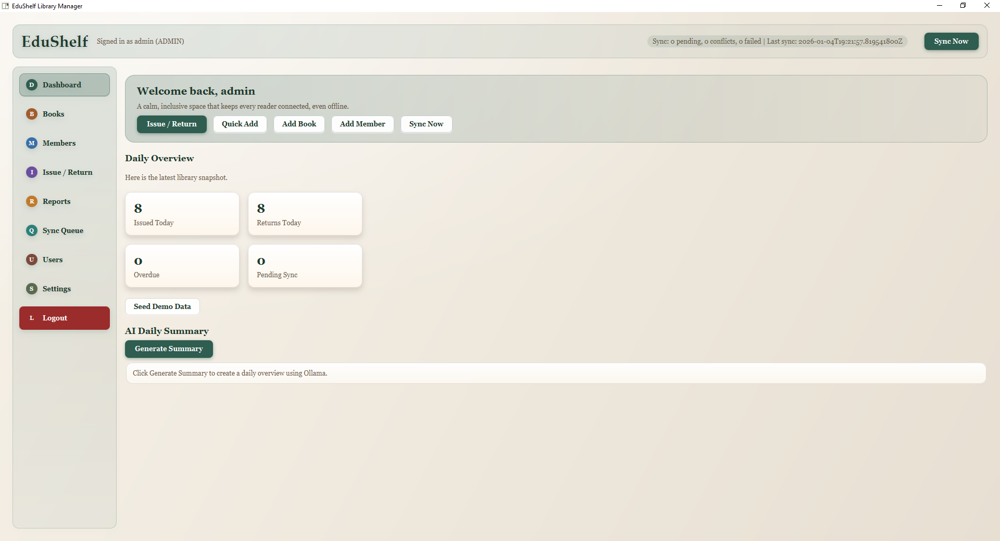
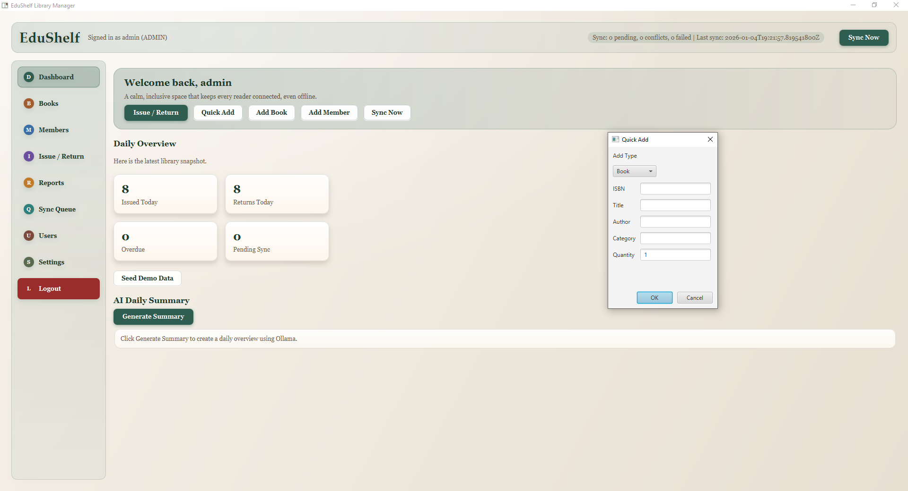
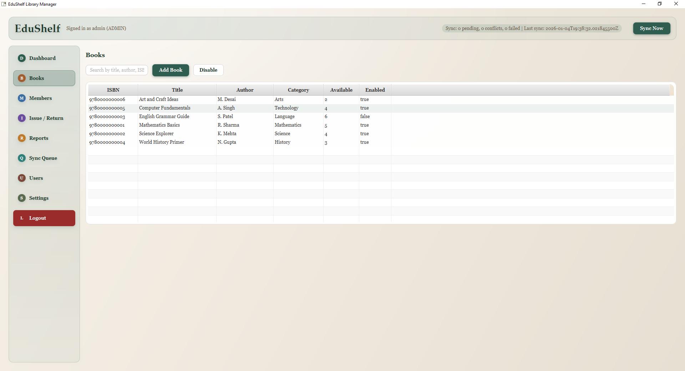
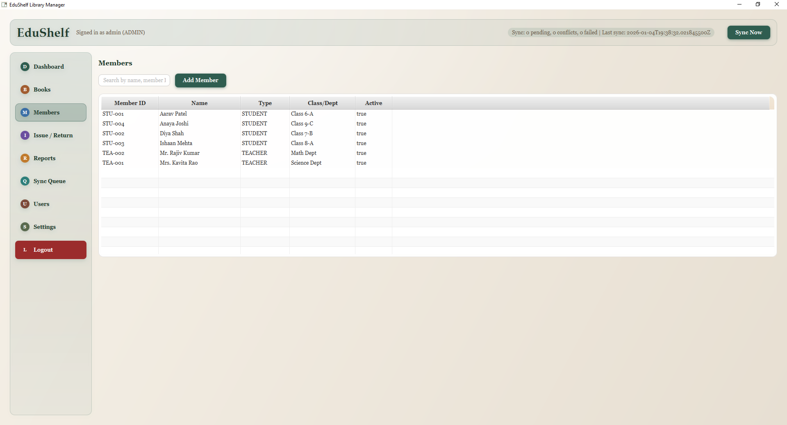
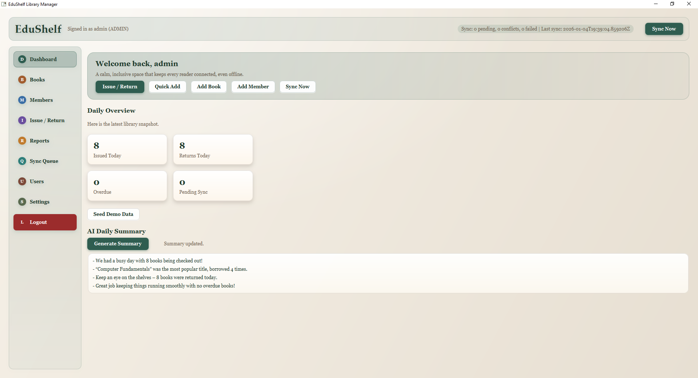
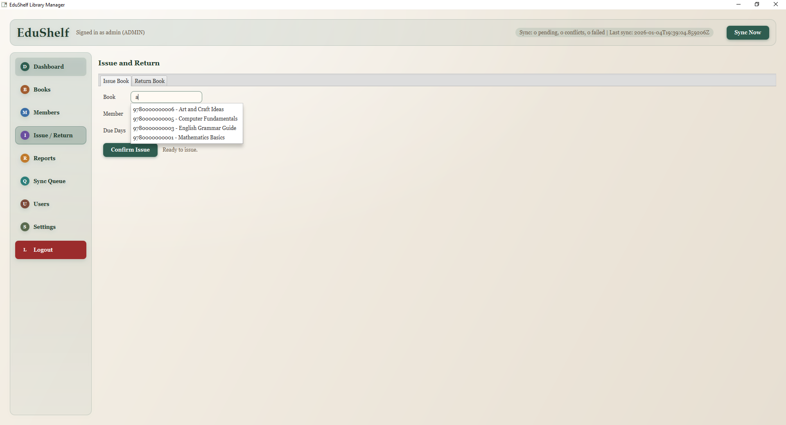
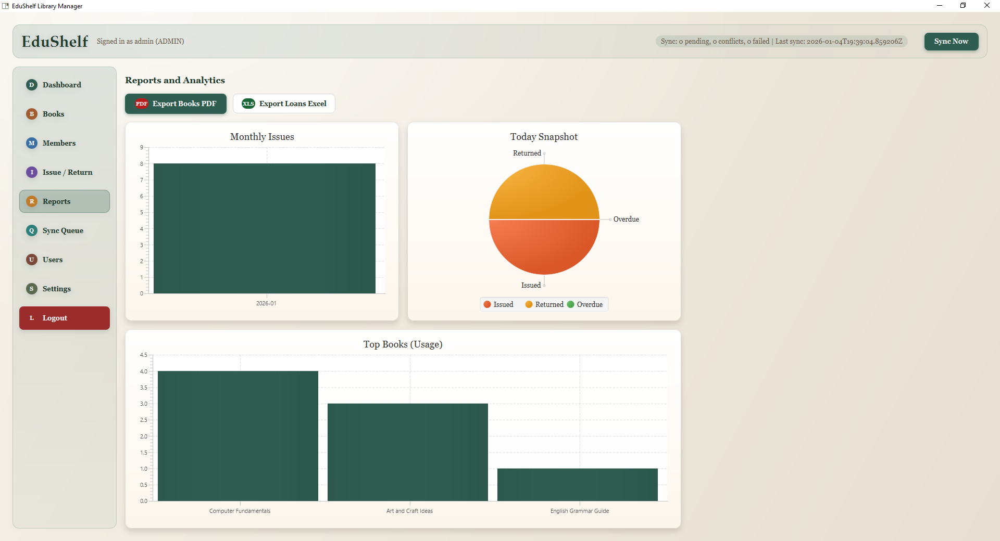
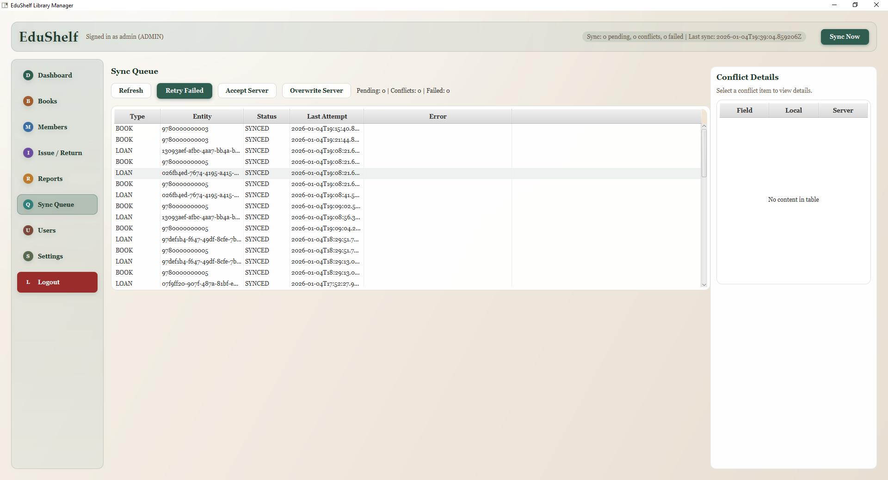
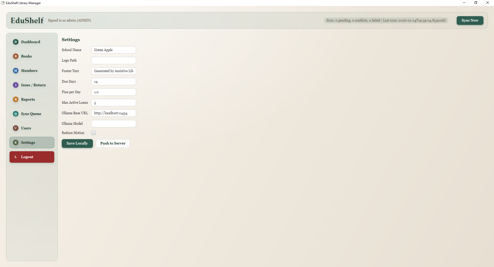
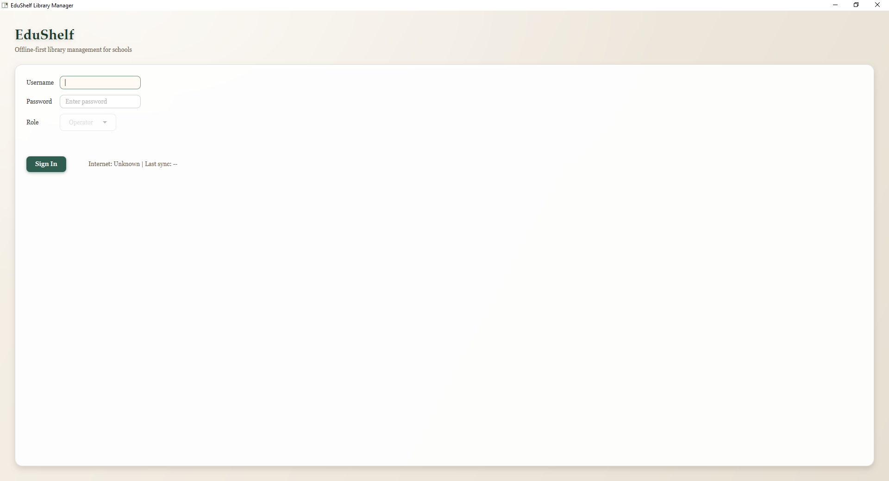

# EduShelf - Assistive Offline-First Library Management System

EduShelf is an offline-first, AI-assisted library management platform designed for schools and inclusive education programs. It keeps libraries running during limited connectivity and lets librarians manage operations remotely with confidence.

## Why it exists

- Many schools still rely on manual registers or outdated software.
- Librarians must be physically present, even when mobility is limited.
- Internet connectivity can be scheduled or unreliable.
- Schools need simple reporting and visibility without extra hardware.

## What it does today

- Offline-first desktop app (JavaFX + SQLite) with automatic sync.
- Role-based login (Admin, Operator, Viewer).
- Book, member, and loan management with real data.
- Issue/return workflow with due dates and fine calculation.
- Sync queue with conflict and failure visibility.
- Reports:
  - Books PDF with school branding.
  - Loans Excel export aligned to the provided template.
- Analytics charts (monthly issues, daily status, top books).
- AI daily summary using a local Ollama model.

## Architecture

- Desktop (JavaFX)
  - Offline storage: SQLite
  - Sync manager + conflict handling
  - Local reports and AI summary
- Server (Spring Boot)
  - PostgreSQL for master data
  - Auth, settings, and sync endpoints

## Screenshots

| Screen | Preview |
| --- | --- |
| Screen 1 |  |
| Screen 2 |  |
| Screen 3 |  |
| Screen 4 |  |
| Screen 5 |  |
| Screen 6 |  |
| Screen 7 |  |
| Screen 8 |  |
| Screen 9 |  |
| Screen 10 |  |
| Screen 11 |  |

## Getting started

Prerequisites:
- JDK 17
- Maven
- PostgreSQL

Server:
```
mvn -pl server spring-boot:run
```

Desktop:
```
mvn -pl desktop javafx:run
```

Environment overrides:
```
DB_URL=jdbc:postgresql://localhost:5432/assistive_library
DB_USERNAME=assistive
DB_PASSWORD=assistive
ASSISTIVE_SERVER_URL=http://localhost:8080
```

Default admin user (created on first run):
- Username: admin
- Password: admin123

## Demo data

Use the "Seed Demo Data" action on the Dashboard to populate sample books and members.

## Docs

- SRS: `docs/Assistive-Offline-First-Library-SRS.docx`
- Product pitch: `docs/PRODUCT_PITCH.md`
- SRS (Markdown): `docs/SRS.md`
- Release notes: `docs/RELEASE_NOTES.md`
- Demo walkthrough: `docs/DEMO_WALKTHROUGH.md`

## Roadmap (high level)

- AI librarian assistant with guided workflows.
- Voice commands and accessibility enhancements.
- Multi-school support and reporting dashboards.
- Branded report templates with pagination.

## License

All rights reserved. Contact the project owner for usage and deployment.
